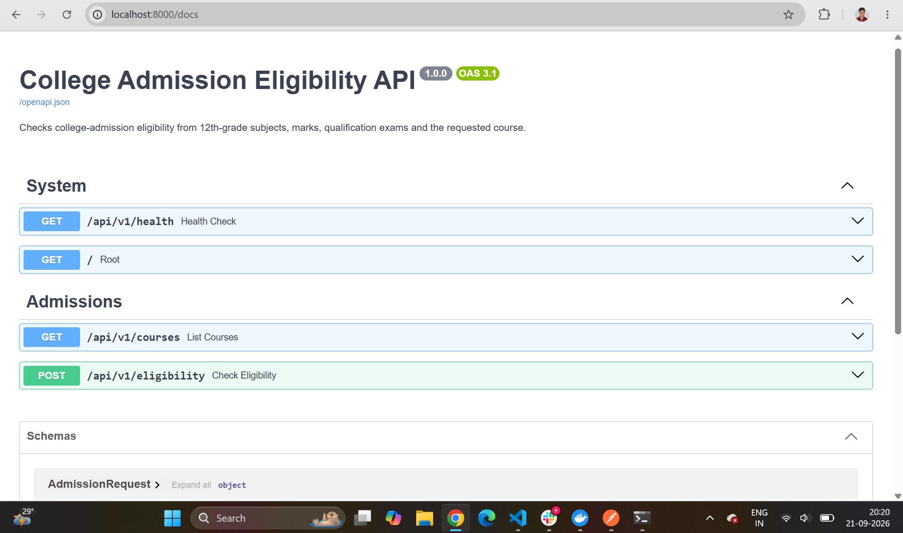
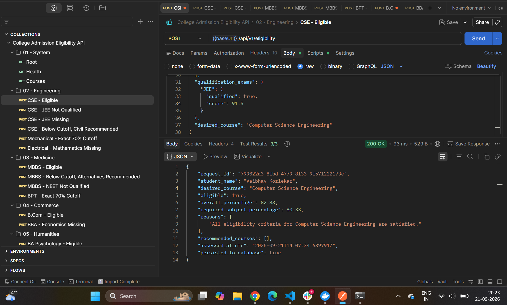
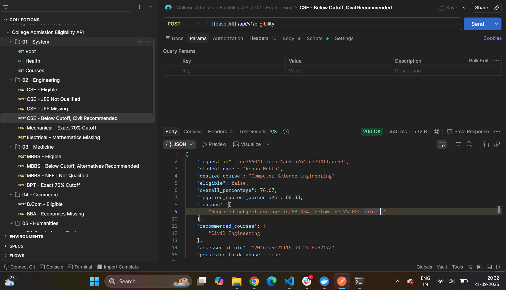
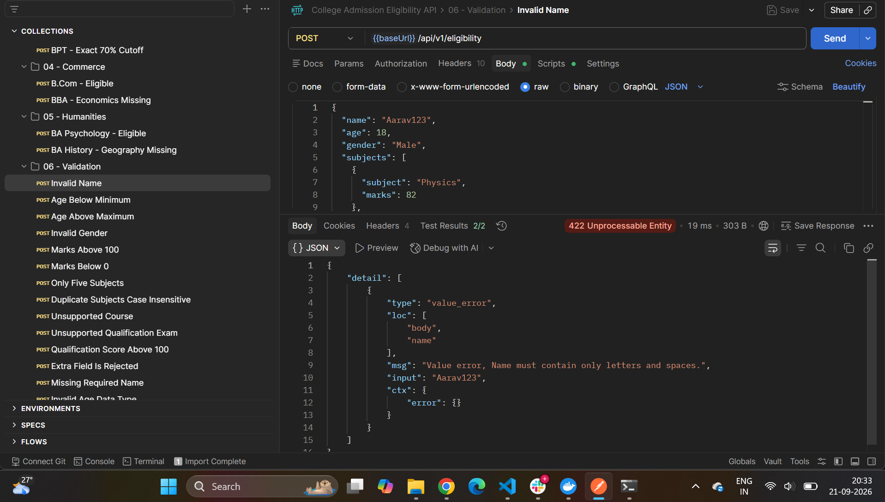
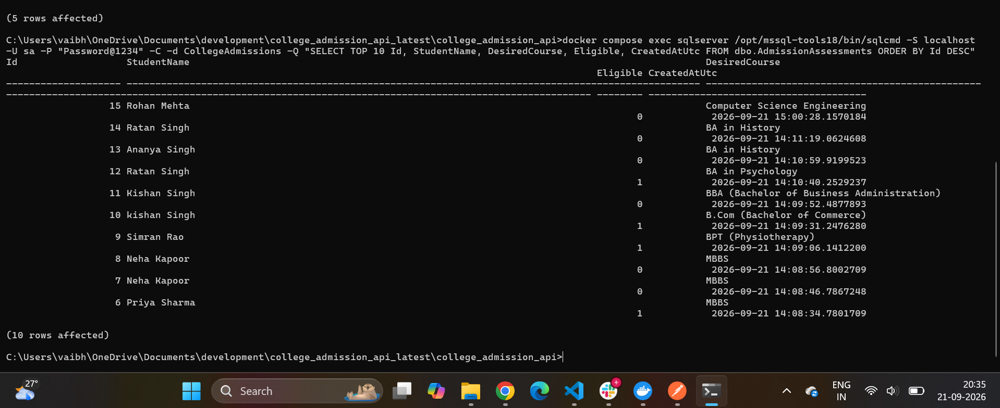
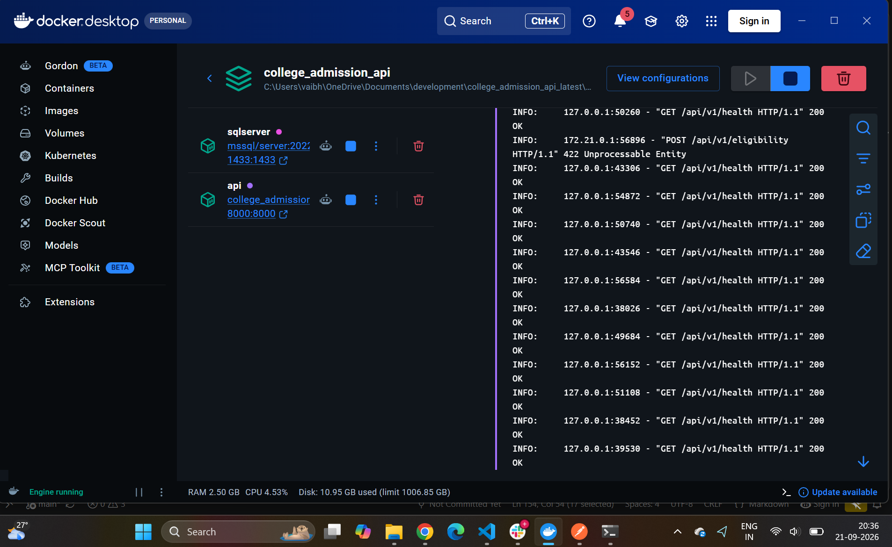

# college admission application

# College Admission Eligibility API

A production-style **FastAPI application** for checking college admission eligibility using a student's demographic details, 12th-grade subjects and marks, qualification exam results, and desired course.

The application validates incoming JSON requests, evaluates eligibility for Engineering, Medicine, Commerce, and Humanities courses, recommends alternative eligible courses when required, stores the request and response in **SQL Server**, and logs application activity.

---

## Project Highlights

- FastAPI REST API with JSON input and output
- Pydantic request validation
- Regular-expression validation using `re`
- Exactly six 12th-grade subjects
- Marks validation between 0 and 100
- Age validation between 17 and 25
- Engineering eligibility using **JEE + PCM + cutoff**
- Medicine eligibility using **NEET + PCB + cutoff**
- Commerce and Humanities subject-combination checks
- Alternative course recommendations
- **NumPy** for numerical calculations
- **Pandas** for structured data processing
- SQL Server persistence using **pyodbc**
- Microsoft ODBC Driver 18 for SQL Server
- Dockerized FastAPI + SQL Server environment
- Application logging
- pytest tests
- Swagger/OpenAPI documentation
- Postman collection support
- Concurrent request handling

---

# Architecture

```text
Client / Postman / Swagger
          |
          | JSON
          v
+--------------------------+
|        FastAPI API       |
| POST /api/v1/eligibility |
+------------+-------------+
             |
             v
+--------------------------+
|     Request Validation   |
|  Pydantic + Regex (re)   |
+------------+-------------+
             |
             v
+--------------------------+
|    Eligibility Service   |
| Engineering / Medicine   |
| Commerce / Humanities    |
+------------+-------------+
             |
        +----+----+
        |         |
        v         v
     NumPy      Pandas
  Calculations  Processing
        |         |
        +----+----+
             |
             v
+--------------------------+
| Recommendation Engine    |
+------------+-------------+
             |
             v
+--------------------------+
|      JSON Response       |
+------------+-------------+
             |
             v
+--------------------------+
|          pyodbc          |
|    ODBC Driver 18        |
+------------+-------------+
             |
             v
+--------------------------+
|     SQL Server 2022      |
| CollegeAdmissions DB     |
+--------------------------+
```

---

# Screenshots / Demo

Create this folder structure:

```text
docs/
└── screenshots/
    ├── 01-architecture.png
    ├── 02-swagger-api.png
    ├── 03-cse-eligible.png
    ├── 04-course-recommendation.png
    ├── 05-validation-error.png
    ├── 06-sqlserver-data.png
    └── 07-docker-running.png
```

## 1. Architecture / LLD


## 2. Swagger API

Open:

```text
http://localhost:8000/docs
```

Expected endpoints:

```text
GET   /api/v1/health
GET   /api/v1/courses
POST  /api/v1/eligibility
```



## 3. Successful Eligibility Response

Example: Computer Science Engineering applicant satisfying PCM, JEE, and cutoff requirements.



## 4. Course Recommendation

When the requested course requirements are not satisfied, the application checks other supported courses and recommends eligible alternatives.



## 5. Validation Error

Examples include invalid name, invalid age, invalid gender, invalid marks, duplicate subjects, unsupported course, invalid qualification exam, and missing fields.



## 6. SQL Server Persistence

Successful assessments are stored in SQL Server.



## 7. Docker Containers

FastAPI and SQL Server run together using Docker Compose.



---

# Tech Stack

| Technology | Purpose |
|---|---|
| Python 3.12 | Application runtime |
| FastAPI | REST API framework |
| Pydantic | Request and response validation |
| `re` | Regular-expression validation |
| NumPy | Numerical calculations |
| Pandas | Subject and marks processing |
| pyodbc | SQL Server connectivity |
| SQL Server 2022 | Database |
| Microsoft ODBC Driver 18 | SQL Server ODBC driver |
| Docker | Containerization |
| Docker Compose | Multi-container orchestration |
| Uvicorn | ASGI server |
| pytest | Automated testing |
| Postman | API testing |

---

# Project Structure

```text
college_admission_api/
│
├── app/
│   ├── api/
│   │   └── routes.py
│   ├── core/
│   │   ├── config.py
│   │   ├── course_catalog.py
│   │   └── logging_config.py
│   ├── db/
│   │   └── sql_server.py
│   ├── models/
│   │   └── schemas.py
│   ├── services/
│   │   └── eligibility.py
│   └── main.py
│
├── tests/
│   └── test_eligibility.py
├── docs/
│   └── screenshots/
├── Dockerfile
├── docker-compose.yml
├── .dockerignore
├── .env.example
├── .gitignore
├── pytest.ini
├── requirements.txt
├── sample_request.json
└── README.md
```

---

# Eligibility Rules

## Engineering

Engineering courses require JEE qualification and the PCM subject combination.

| Course | Required Subjects | Exam | Cutoff |
|---|---|---|---:|
| Computer Science Engineering | Physics, Chemistry, Mathematics | JEE | 75% |
| Mechanical Engineering | Physics, Chemistry, Mathematics | JEE | 70% |
| Electrical Engineering | Physics, Chemistry, Mathematics | JEE | 70% |
| Civil Engineering | Physics, Chemistry, Mathematics | JEE | 65% |
| Electronics and Communication Engineering | Physics, Chemistry, Mathematics | JEE | 70% |

Example:

```text
Physics     = 82
Chemistry   = 78
Mathematics = 90

Required-subject average = 83.33%
```

For CSE, `83.33 >= 75`, so the cutoff is satisfied.

## Medicine

Medical courses require NEET qualification and the PCB subject combination.

| Course | Required Subjects | Exam | Cutoff |
|---|---|---|---:|
| MBBS | Physics, Chemistry, Biology | NEET | 85% |
| BDS (Dentistry) | Physics, Chemistry, Biology | NEET | 80% |
| BAMS (Ayurveda) | Physics, Chemistry, Biology | NEET | 75% |
| BHMS (Homeopathy) | Physics, Chemistry, Biology | NEET | 75% |
| BPT (Physiotherapy) | Physics, Chemistry, Biology | NEET | 70% |

## Commerce

The requirements do not specify a numerical cutoff. Eligibility is based on these required subjects:

- Accountancy
- Business Studies
- Economics

Supported courses:

- B.Com (Bachelor of Commerce)
- BBA (Bachelor of Business Administration)
- BBM (Bachelor of Business Management)
- CA (Chartered Accountancy)

## Humanities

| Course | Required Subjects |
|---|---|
| BA in History | History, Political Science, Geography |
| BA in Psychology | Psychology, Sociology, English |
| BA in Sociology | Sociology, Political Science, History |
| BA in Political Science | Political Science, History, Geography |
| BA in English | English, History, Political Science |

---

# Input Validation

The API validates requests before running eligibility rules.

- **Name:** letters and spaces only
- **Age:** 17 to 25
- **Gender:** `Male`, `Female`, or `Other`
- **Subjects:** exactly six unique subjects
- **Marks:** 0 to 100
- **Qualification exams:** JEE and NEET
- **Desired course:** must exist in the configured course catalogue
- Unexpected fields are rejected by the request model

Example valid subject:

```json
{
  "subject": "Physics",
  "marks": 82
}
```

---

# API Endpoints

## Health Check

```http
GET /api/v1/health
```

```bash
curl http://localhost:8000/api/v1/health
```

Expected:

```json
{
  "status": "ok"
}
```

## List Supported Courses

```http
GET /api/v1/courses
```

```bash
curl http://localhost:8000/api/v1/courses
```

## Check Eligibility

```http
POST /api/v1/eligibility
Content-Type: application/json
```

---

# Sample Request

```json
{
  "name": "Aarav Sharma",
  "age": 18,
  "gender": "Male",
  "subjects": [
    {"subject": "Physics", "marks": 82},
    {"subject": "Chemistry", "marks": 78},
    {"subject": "Mathematics", "marks": 90},
    {"subject": "English", "marks": 88},
    {"subject": "Computer Science", "marks": 95},
    {"subject": "Physical Education", "marks": 91}
  ],
  "qualification_exams": {
    "JEE": {
      "qualified": true,
      "score": 88.5
    }
  },
  "desired_course": "Computer Science Engineering"
}
```

# Sample Successful Response

```json
{
  "request_id": "generated-request-id",
  "student_name": "Aarav Sharma",
  "desired_course": "Computer Science Engineering",
  "eligible": true,
  "overall_percentage": 87.33,
  "required_subject_percentage": 83.33,
  "reasons": [
    "All eligibility criteria for Computer Science Engineering are satisfied."
  ],
  "recommended_courses": [],
  "persisted_to_database": true
}
```

# Course Recommendation Example

A student applying for CSE may fail the 75% CSE cutoff but still satisfy Civil Engineering's 65% cutoff.

```json
{
  "eligible": false,
  "recommended_courses": [
    "Civil Engineering"
  ]
}
```

---

# Error Handling

| Scenario | HTTP Status |
|---|---:|
| Valid and eligible | 200 |
| Valid but not eligible | 200 |
| Invalid request data | 422 |
| Unsupported endpoint | 404 |
| Wrong HTTP method | 405 |
| Database persistence unavailable | 503 |
| Unexpected server error | 500 |

A student failing admission criteria is a business-rule result, not an API error.

---

# SQL Server Persistence

Database:

```text
CollegeAdmissions
```

Main table:

```text
dbo.AdmissionAssessments
```

Stored information includes:

- Request ID
- Student name
- Desired course
- Eligibility result
- Input JSON
- Output JSON
- Creation timestamp

Example query:

```sql
SELECT TOP 10
    Id,
    StudentName,
    DesiredCourse,
    Eligible,
    CreatedAtUtc
FROM dbo.AdmissionAssessments
ORDER BY Id DESC;
```

Inspect the table schema from PowerShell:

```powershell
docker compose exec sqlserver /opt/mssql-tools18/bin/sqlcmd `
  -S localhost `
  -U sa `
  -P "YOUR_PASSWORD" `
  -C `
  -d CollegeAdmissions `
  -Q "EXEC sp_help 'dbo.AdmissionAssessments'"
```

---

# Docker Architecture

```text
Windows / Docker Desktop
        |
        +-----------------------------+
        | Docker Compose Network      |
        |                             |
        |  FastAPI Container          |
        |  Python 3.12                |
        |  FastAPI                    |
        |  NumPy / Pandas             |
        |  pyodbc                     |
        |  ODBC Driver 18             |
        |        |                    |
        |        | sqlserver:1433     |
        |        v                    |
        |  SQL Server 2022 Container  |
        +-----------------------------+
```

---

# Run Using Docker

## 1. Create `.env`

```powershell
Copy-Item .env.example .env
```

Example:

```env
APP_NAME=College Admission Eligibility API
APP_VERSION=1.0.0
LOG_LEVEL=INFO
LOG_FILE=logs/admissions.log

DB_HOST=localhost
DB_PORT=1433
DB_NAME=CollegeAdmissions
DB_USER=sa
DB_PASSWORD=YourStrongPassword
DB_DRIVER=ODBC Driver 18 for SQL Server
DB_ENCRYPT=yes
DB_TRUST_SERVER_CERTIFICATE=yes
```

> Never commit `.env` to Git.

## 2. Build

```powershell
docker compose build
```

## 3. Start

```powershell
docker compose up -d
```

## 4. Verify

```powershell
docker compose ps
```

Expected:

```text
college-admission-sqlserver   Up (healthy)
college-admission-api         Up
```

## 5. Open Swagger

```text
http://localhost:8000/docs
```

Stop the project:

```powershell
docker compose down
```

Delete the local SQL Server volume as well:

```powershell
docker compose down -v
```

> `-v` deletes persisted local database data.

---

# Run Locally with a Windows Virtual Environment

SQL Server can remain in Docker while FastAPI runs on Windows.

```powershell
python -m venv .venv
.\.venv\Scripts\Activate.ps1
python -m pip install --upgrade pip
pip install -r requirements.txt
```

Start SQL Server only:

```powershell
docker compose up -d sqlserver
```

Start FastAPI:

```powershell
uvicorn app.main:app --reload --host 0.0.0.0 --port 8000
```

Open:

```text
http://127.0.0.1:8000/docs
```

When FastAPI runs directly on Windows, Microsoft ODBC Driver 18 must also be installed on Windows.

---

# Testing

Run:

```powershell
pytest
```

Verbose:

```powershell
pytest -v
```

Core tests cover scenarios such as:

- Successful Engineering eligibility
- Qualification-exam failure
- Alternative course recommendations

---

# Postman

A robust Postman collection can be used to test the application.

Recommended folders:

```text
01 - System
02 - Engineering
03 - Medicine
04 - Commerce
05 - Humanities
06 - Validation
07 - HTTP and Infrastructure Errors
```

Important scenarios include:

- Health check
- Course listing
- CSE eligible
- CSE without JEE
- CSE below cutoff with recommendation
- Required Engineering subject missing
- MBBS eligible
- MBBS below cutoff
- MBBS without NEET
- Commerce eligible
- Humanities eligible
- Invalid name
- Invalid age
- Invalid gender
- Invalid marks
- Duplicate subjects
- Unsupported course
- Unsupported exam
- Missing fields
- Wrong HTTP method
- Unknown endpoint
- Database unavailable

---

# Logging

Application log location:

```text
logs/admissions.log
```

Docker API logs:

```powershell
docker compose logs api
```

Follow API logs:

```powershell
docker compose logs -f api
```

SQL Server logs:

```powershell
docker compose logs sqlserver
```

---

# Concurrency

FastAPI runs on an ASGI server and can process multiple requests concurrently.

Because `pyodbc` is synchronous, database work is performed in worker threads instead of blocking the async event loop. Database operations use separate connections rather than a shared global cursor.

---

# Security Notes

- Database credentials are loaded from environment variables
- `.env` should not be committed
- SQL queries use parameterized statements
- Internal tracebacks should not be exposed to API clients
- SQL Server communication between containers uses the Docker Compose network
- Microsoft ODBC Driver 18 is used for connectivity

Production enhancements should include:

- Dedicated non-`sa` application user
- Secret management
- HTTPS
- Authentication and authorization
- Rate limiting
- Database backups
- Centralized logging and monitoring

---

# Assessment Requirements Covered

| Requirement | Status |
|---|---|
| JSON input | Implemented |
| JSON output | Implemented |
| Name regex validation | Implemented |
| Age 17–25 validation | Implemented |
| Gender validation | Implemented |
| Six-subject validation | Implemented |
| Marks 0–100 validation | Implemented |
| Course validation | Implemented |
| Engineering eligibility | Implemented |
| Medicine eligibility | Implemented |
| Commerce eligibility | Implemented |
| Humanities eligibility | Implemented |
| Alternative recommendations | Implemented |
| NumPy | Implemented |
| Pandas | Implemented |
| FastAPI | Implemented |
| `re` | Implemented |
| pyodbc | Implemented |
| SQL Server persistence | Implemented |
| Logging | Implemented |
| Concurrent request handling | Implemented |
| Docker SQL Server | Implemented |
| Dockerized FastAPI | Implemented |
| Windows virtual environment | Implemented |
| pytest | Implemented |
| Postman scenarios | Implemented |

---

# Future Improvements

- JWT authentication
- Role-based access control
- Admin dashboard
- Configurable admission rules stored in SQL Server
- College-specific policies
- Rank/percentile-based JEE and NEET rules
- Reservation/category-aware criteria where applicable
- Batch eligibility processing
- CSV/Excel upload
- Analytics dashboard
- CI/CD pipeline
- Cloud deployment
- Database migrations

---

# End-to-End Flow

```text
JSON Request
     |
     v
FastAPI
     |
     v
Validation
     |
     v
Pandas / NumPy
     |
     v
Eligibility Rules
     |
     v
Recommendation Engine
     |
     v
JSON Response
     |
     v
pyodbc
     |
     v
SQL Server
     |
     v
Application Logging
```

This project demonstrates API development, validation, business-rule implementation, data processing, database persistence, containerization, logging, testing, and API documentation in one structured Python application.